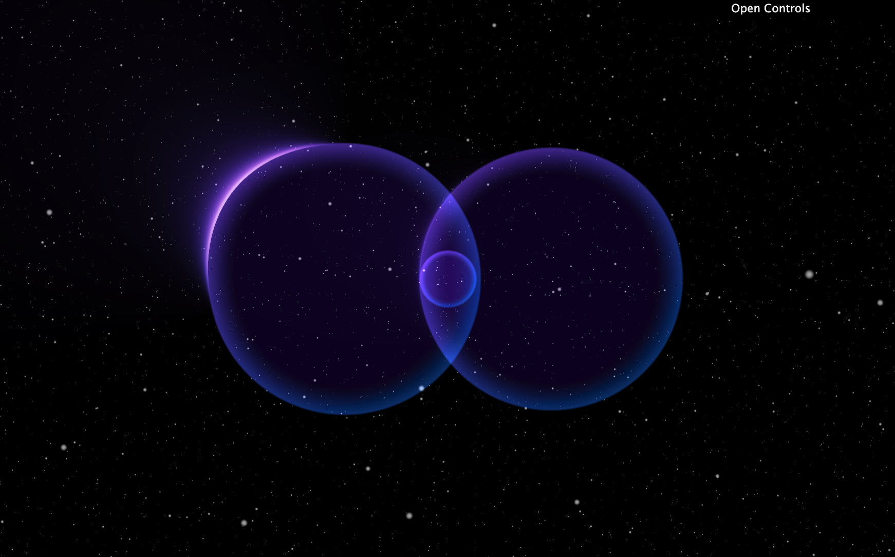

# Loophole prototype

Iterative prototype shader for Loophole project. Current state is temporary until final visuals are agreed.

### TODO:
- [ ] Replace star field with particle rendering
- [ ] Simplify/remove wave solver if not needed
- [ ] Track touch events
